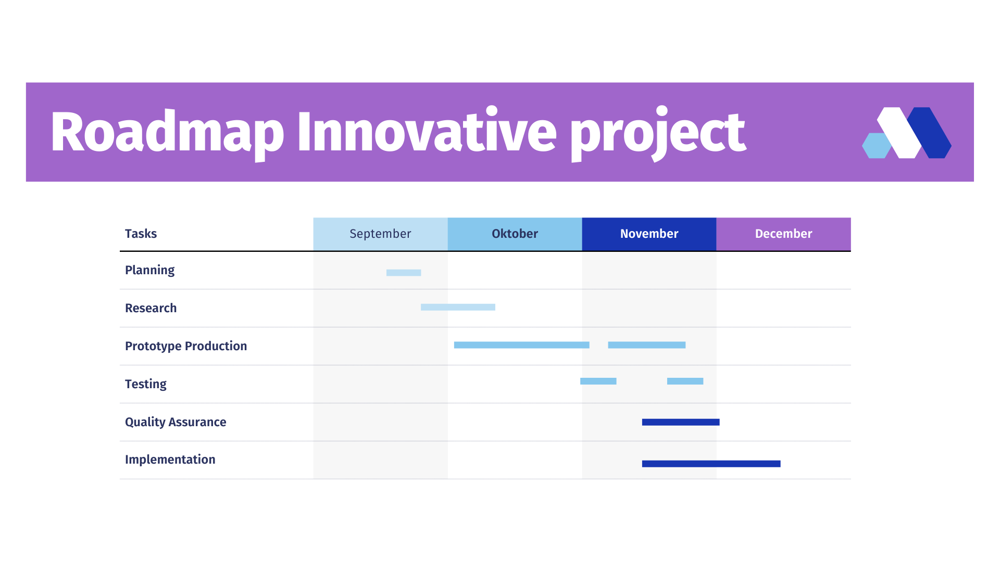

# Organizeer deze map zoals je zelf wenst

Plaats hier je research nota's, voorbereidingen en verslagen.

Overschrijf deze readme gerust met een aangename inhoudstabel.

# Roadmap

# Bronnenlijst
- [(09/25/2023) Flutter installeren](https://docs.flutter.dev/get-started/install/windows)
- [(09/28/2023) Flutter widgets](https://docs.flutter.dev/ui/widgets)
- [(09/28/2023) Flutter tutorial](https://www.youtube.com/watch?v=1xipg02Wu8s)
- [(09/28/2023) Flutter navigatie](https://docs.flutter.dev/ui/navigation)
- [(09/28/2023) Google navbar](https://pub.dev/packages/google_nav_bar)
- [(10/02/2023) Custom ListTile](https://api.flutter.dev/flutter/material/ListTile-class.html)
- [(10/02/2023) Pass data](https://www.youtube.com/watch?v=d5PpeNb-dOY)
- [(10/11/2023) MVVM in flutter](https://medium.com/flutterworld/flutter-mvvm-architecture-f8bed2521958)
- [(10/11/2023) Shades on afbeelding](https://stackoverflow.com/questions/50543031/darken-edges-of-an-image-in-flutter)
- [(10/11/2023) UI inspiratie voor event detail tiles](https://www.youtube.com/watch?v=OmYL-VK75-o)
- [stateless vs stateful](https://www.youtube.com/watch?v=HsVUC6CcOqY&t=64s)
- [Timeline voor performances](https://www.youtube.com/watch?v=WP0h7utvaUc&t=369s)
- [Geolocation gebruiken](https://www.youtube.com/watch?v=MYHVyl-juUk&t=186s)
- [google_maps_flutter tutorial](https://www.youtube.com/watch?v=tfFByL7F-00)
- [google_maps_flutter package](https://pub.dev/packages/google_maps_flutter)
- [Custom markers voor google_maps_flutter package](https://www.youtube.com/watch?v=MrnA6vpTXik)
- [API requests in flutter](https://docs.flutter.dev/cookbook/networking/fetch-data)

# Mijn ervaring met Flutter

Flutter is zoals Xamarin ook een cross-platform development platform. Het is een framework dat runt op de taal Dart en heeft hier en daar een trek mee van C#.
Het eerste wat ik opmerkte was dat de UI bouwen veel vlotter ging dan in Xamarin. Het werkt via widgets, die je dan telkens kan instellen. In het begin kwam dit goed van pas maar al snel had ik wat extra nodig, dus maakte ik enkele custom widgets.
Het is ook mogelijk om de widgets te nesten, en te hergebruiken wat het geheel nog vlotter maakt. Dit kan soms wat verwarrend zijn qua readability, maar ik heb er geen problemen mee gehad.
De navigatie is ook heel vlot, je kan een route aanmaken en deze dan pushen naar de stack. Je kan ook een route poppen van de stack, wat het mogelijk maakt om terug te gaan naar de vorige pagina.

Ook heb ik gemerkt dat Flutter populairder is dan Xamarin, wat het makkelijker maakt om oplossingen te vinden voor problemen. Er zijn ook veel meer packages beschikbaar voor Flutter dan voor Xamarin.
De hot reload functie in flutter werkt sneller en vlotter dan in Xamarin, wat het ontwikkelen ook vlotter maakt.